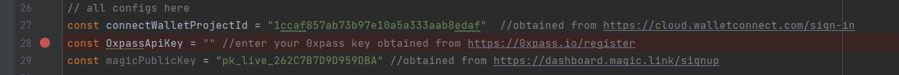

# Getting Started with Create React App

This project was bootstrapped with [Create React App](https://github.com/facebook/create-react-app).

## Install the project

In the project directory, you can run:


```bash
#fastest - takes only 46 seconds.
yarn install
```
or 

```bash
npm install --force
```


## Signup on 0xpass

Signup on [0xpass Dashboard](https://dashboard.0xpass.io/)

## Create a new project


## Extract project ID and API Keys

Once you are inside project, copy 0xpass API Keys(2)


## Replace 0xpass apiKey in index.tsx
Line 28



## Start the appp

```bash
yarn start
```

**OR**

```bash
npm start
```

