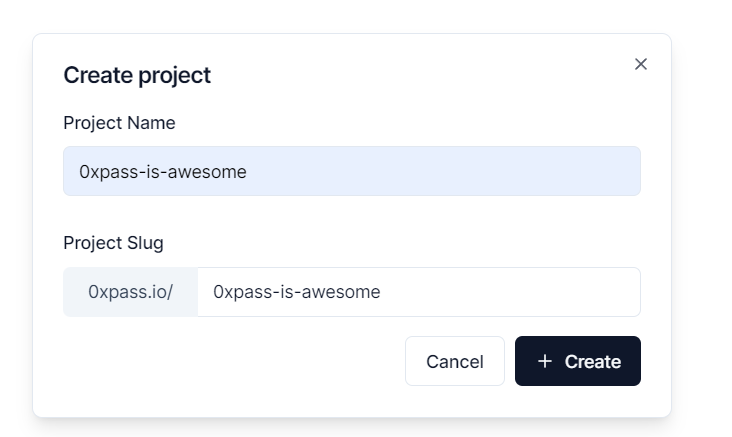
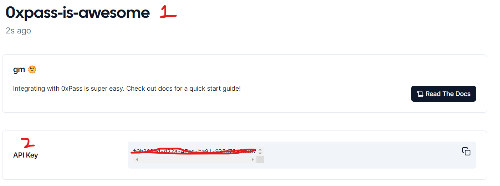
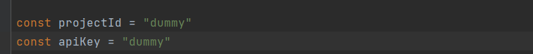

# Getting Started with Create React App

This project was bootstrapped with [Create React App](https://github.com/facebook/create-react-app).

## Install the project

In the project directory, you can run:

```bash
npm install --legacy-peer-deps
```

or 
```bash
yarn install
```

## Signup on 0xpass

Signup on [0xpass Dashboard](https://dashboard.0xpass.io/)

## Create a new project




## Extract project ID and API Keys

Once you are inside project, copy Project ID(1) and API Keys (2)



## Replace projectID and apiKey in index.tsx
Line 27 and 28



## Start the appp

```bash
npm start
```

**OR**

```bash
yarn start
```

